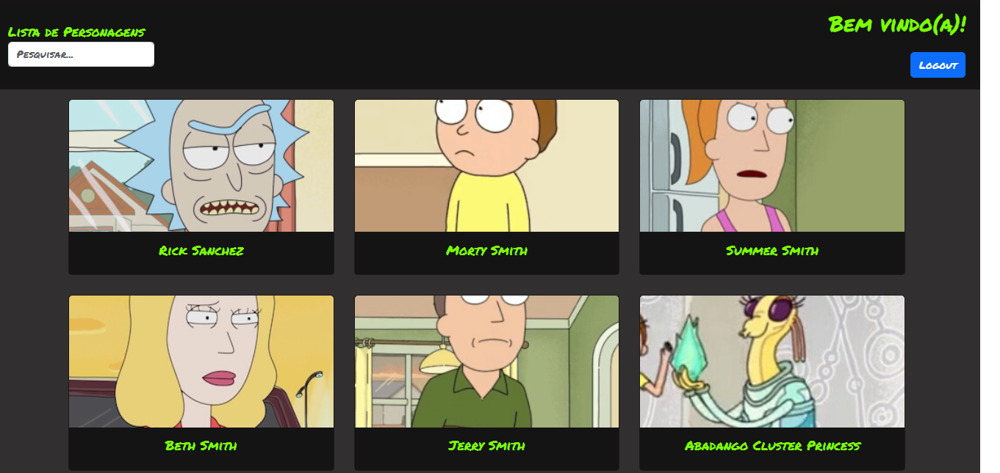
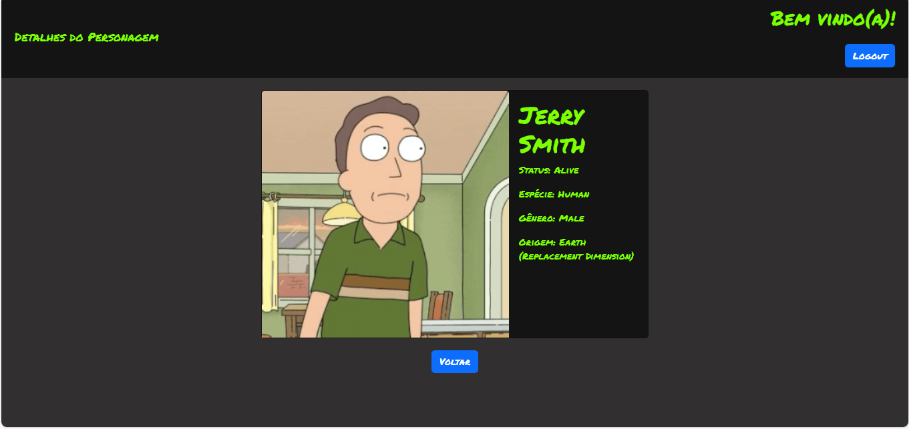
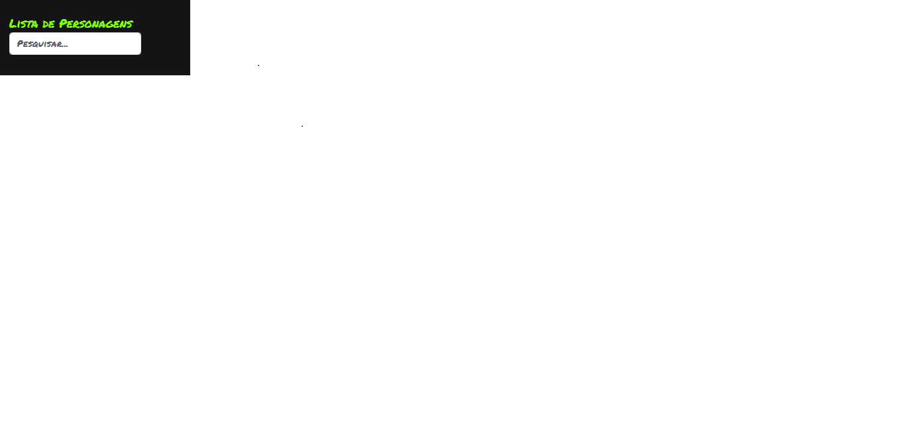
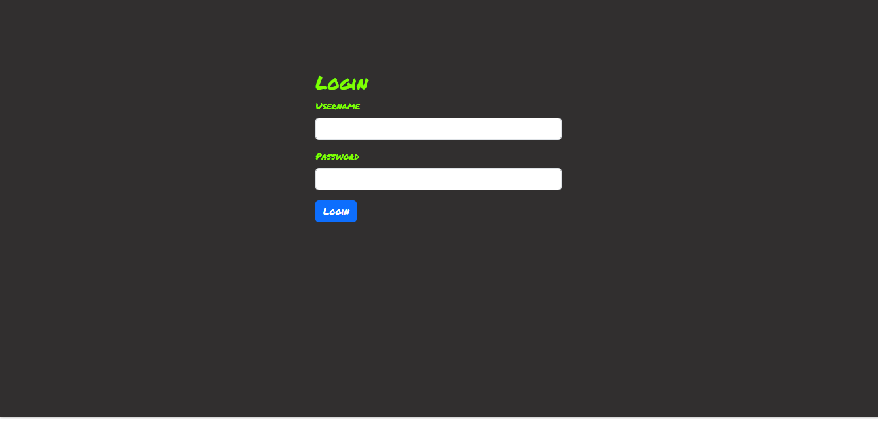

# Rick & Morty Dashboard SPA

Este é um projeto desenvolvido em Angular que consome a API Rick & Morty ([https://rickandmortyapi.com/](https://rickandmortyapi.com/)). O objetivo deste projeto é permitir que os usuários visualizem uma lista de personagens, vejam os detalhes de cada personagem e façam login para acessar.

## Configuração do Ambiente de Desenvolvimento

Para executar este projeto localmente, siga estas etapas:

1. Certifique-se de ter o Node.js e o Angular CLI instalados em seu ambiente de desenvolvimento.
2. Clone este repositório em sua máquina local.
3. No diretório raiz do projeto, execute o seguinte comando para instalar as dependências:

```bash
npm install
```

4. Após a instalação das dependências, você pode iniciar o servidor de desenvolvimento com o seguinte comando:

```bash
npm start
```

5. O aplicativo estará disponível em `http://localhost:4200/` por padrão. Você pode acessar este URL em seu navegador para visualizar o aplicativo.

6. Para logar na aplicação utilize os seguintes dados:
Username: Yhuri
Password: 1234

## Funcionalidades

O aplicativo possui as seguintes funcionalidades:

1. **Lista de Personagens**: Exibe uma lista de personagens com seus nomes e imagens, com paginação infinita.

    

2. **Detalhes do Personagem**: Permite visualizar os detalhes de cada personagem, incluindo status, espécie, gênero, origem e localização.

    

3. **Busca de Personagens**: Permite aos usuários buscar personagens pelo nome.

    

4. **Autenticação**: Permite aos usuários fazer login.

    

## Estrutura do Projeto

O projeto está estruturado da seguinte forma:

- **src/app/models**: Contém as definições de modelos TypeScript utilizados para representar os dados dos personagens.
- **src/app/components**: Contém os componentes Angular utilizados no projeto, como `character-list`, `character-detail`.
- **src/app/pages**: Contém os componentes das páginas, como `character-list-page`, `character-detail-page` e `login`.
- **src/app/services**: Contém os serviços Angular utilizados para buscar dados da API Rick & Morty e gerenciar a autenticação.

## Dependências Externas

Este projeto utiliza as seguintes dependências externas:

- **Angular**: Framework JavaScript para construção de aplicações web.
- **RxJS**: Biblioteca para programação reativa em JavaScript.
- **HttpClientModule**: Módulo Angular para realizar requisições HTTP.
- **Bootstrap**: Framework de CSS para estilização responsiva.
